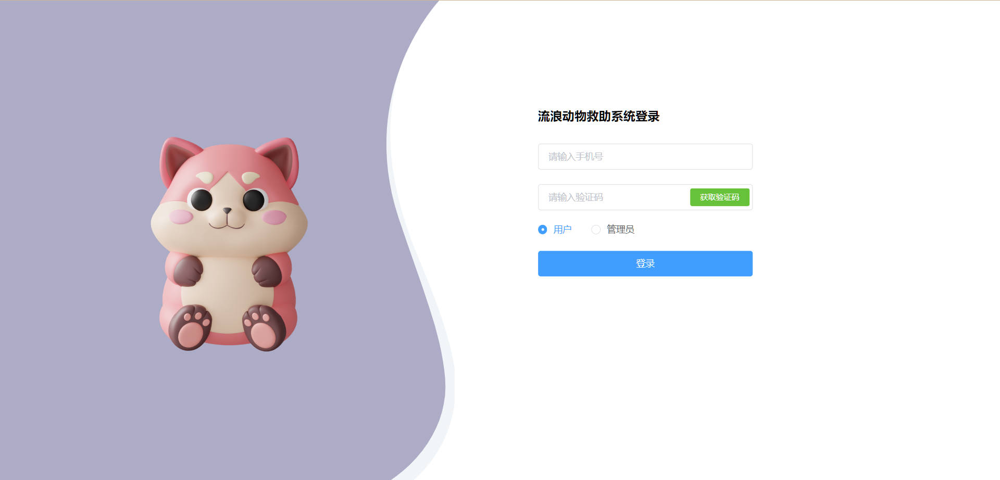
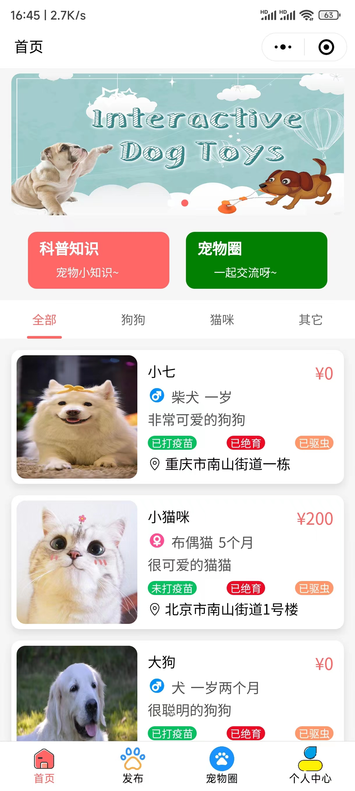
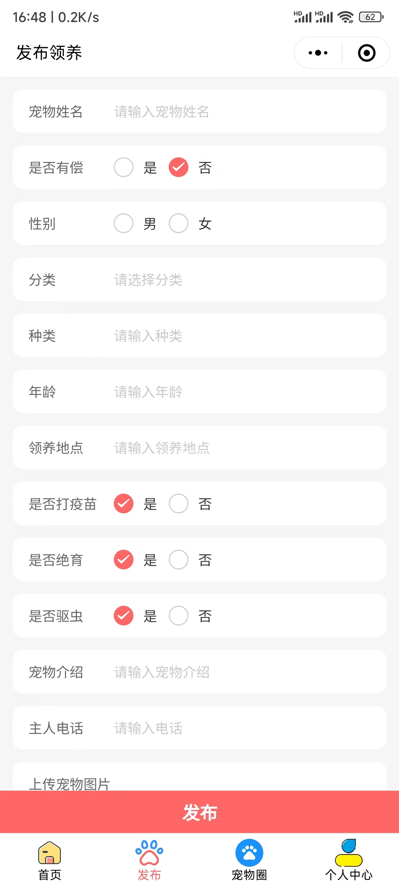
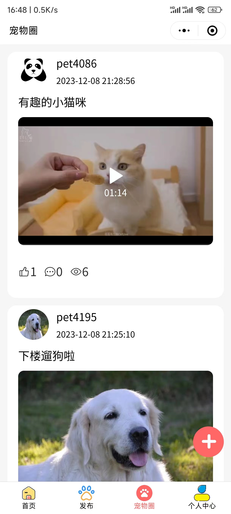
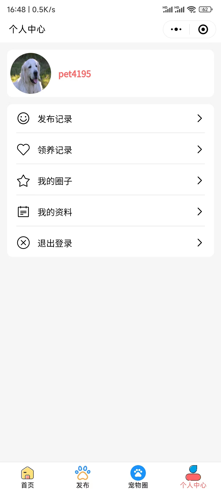
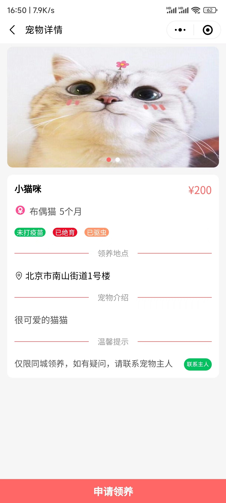
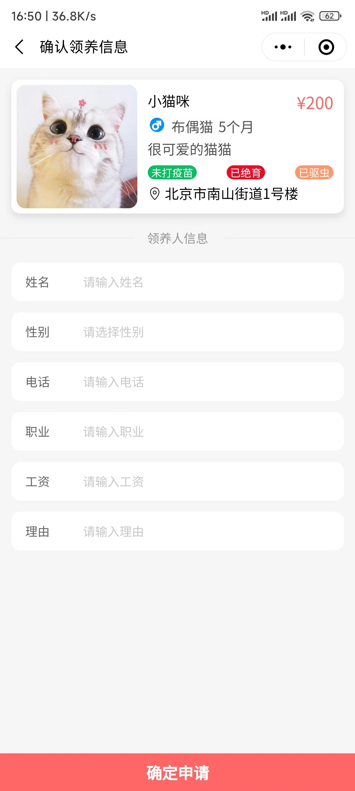
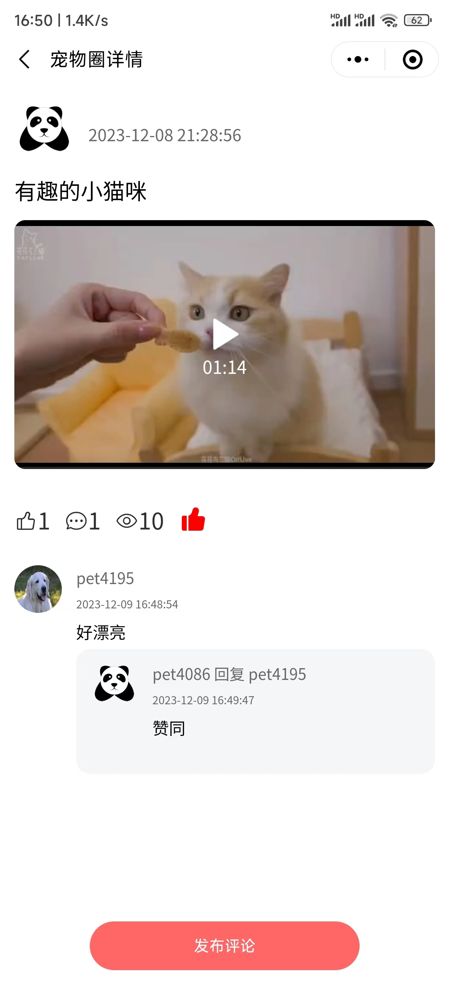
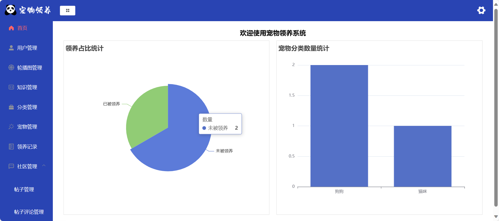

# 宠物领养小程序 流浪动物救助系统

## 一、介绍
 基于node+vue宠物领养小程序，宠物领养系统，分为两个角色，管理员和用户 其中用户端可以为pc端，也可以为微信小程序，是两套
 1. 用户：发布需要被领养的宠物，也可以领养宠物，用户可以审核领养人的信息，是否通过领养，查看科普知识，分享宠物的日常等等
 2. 管理员：用户管理，宠物管理，知识管理等等
 3. 温馨提示：这个代码不完整，如有需要可咨询我们
## 二、技术栈
1.  前端：vue框架，微信原生小程序
2.  后端：nodejs express框架
3.  数据库：mysql
## 流浪动物救助系统

## 三、效果展示图
### 1.用户端
##### 首页

##### 发布宠物

##### 宠物圈

##### 个人中心

##### 宠物详情

##### 确认领养

##### 宠物圈详情

### 2.管理端

##### 后台功能

## 四、🚀 咨询我们
1.  有需要或者疑问可加微信号：rolling_257
2.  请备注 宠物领养小程序源码获取
3.  提示该项目需要付费获取，编码不易

